# Creating Mobile Apps using Ionic Framework and ABP Framework

## Introduction

In this article, we will create an example application which will use the [ABP Framework](https://www.abp.io) as backend for a mobile application which can run on an iOS or Andriod mobile device using [Ionic Framework](https://ionicframework.com).

Source Code of the completed application is avalibale on Github.

## Sreenshots

Here, is a preview of the Ionic App

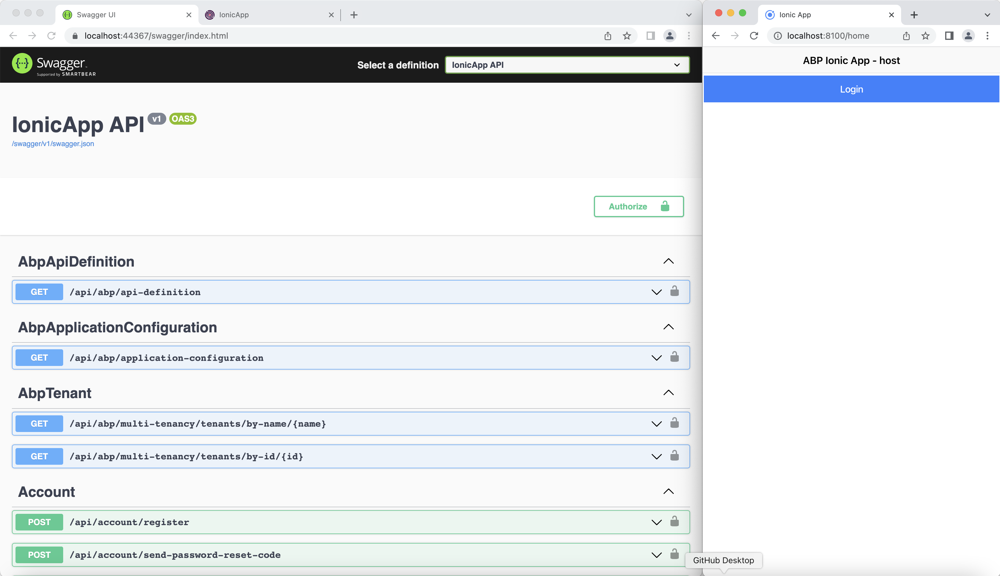

## Requirements

If you haven't used ABP or Ionic Framework before you need to install and setup a few things. So lets get strated.

### Node.js

In order to install and run both ABP and Ionic Framework you first need to install the Node environment. You can either [download and install it from here](https://nodejs.org/en/) or if you are on Mac [use Homebrew to install it like described here ](https://blog.teamtreehouse.com/install-node-js-npm-mac).

To test your setup, you can run the following two commands on the your CL:

```bash
node -v

npm -v
```

Make sure you can open your command line and get a result for both of the commands. Your versions might be different at the time of installing it but that should be ok if you are up to date!

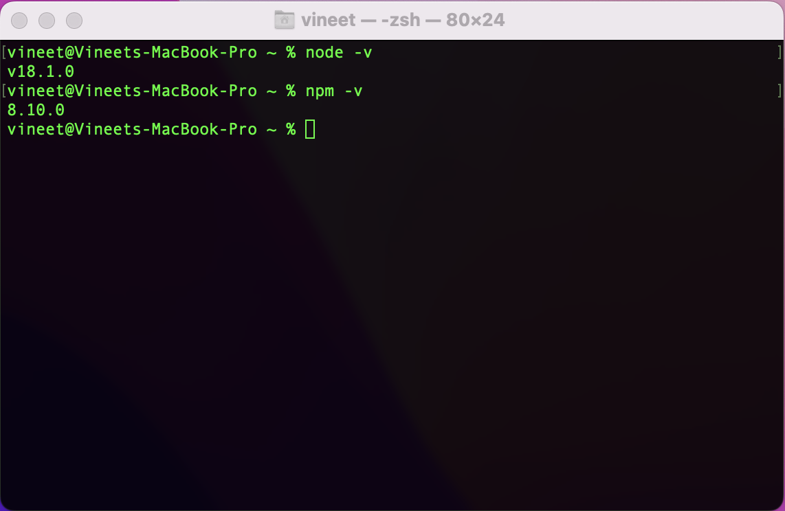

### Yarn

You will also need Yarn insalled for ABP Framework, you can install Yarn through the npm package manager which comes bundled with Node.js when you install it on your system. Ensure that it is Yarn v1.20+ not v2. ABP Framework doesn't support Yean v2

```bash
npm install -g yarn
```

Run the folowing command to check the version of Yarn.

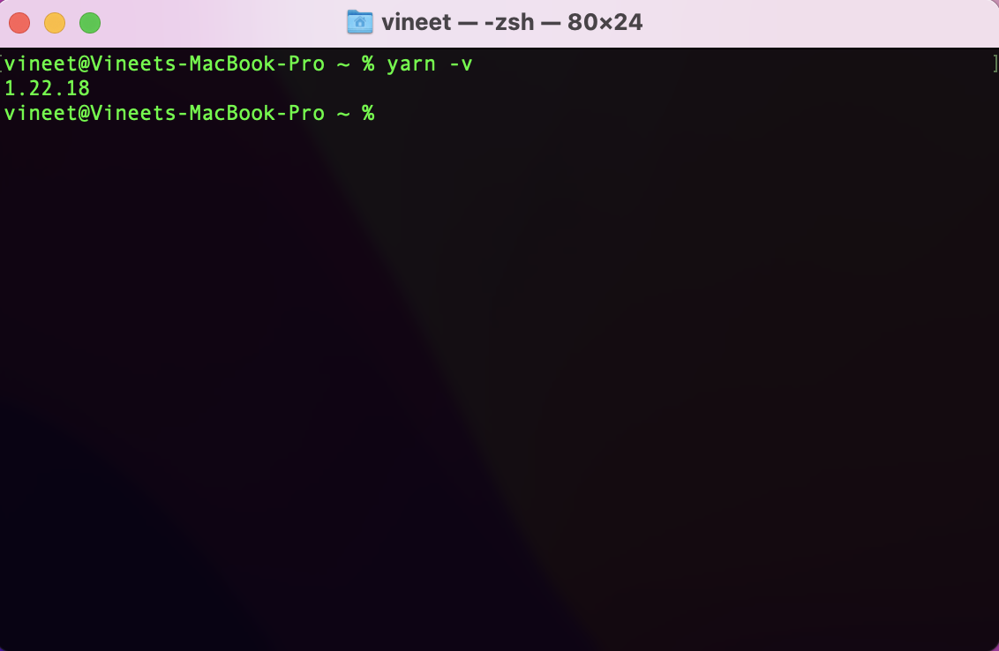

### ABP CLI

You will also need to have the ABP CLI installed to create the startup template. ABP CLI is a command line insterface that is used to automate some common tasks for the ABP framework based solution.

In order to install the ABP CLI you will need an IDE such as [Visual Studio](https://visualstudio.microsoft.com/vs/) that uspports [.Net 6.0+](https://dotnet.microsoft.com/download/dotnet) installed

You can install it by running the following command on your CL:

```bash
dotnet tool install -g Volo.Abp.CLI
```

Once the ABP CLI is installed you can run the following command, at the time of writing this article, ABP Framework is at 5.2.2!

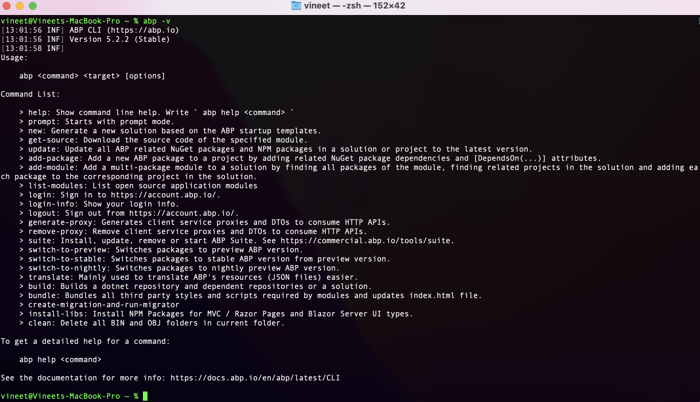

## ABP Solution

We will be using ABP with Angular UI for our backend, so we will first create a new solution using the ABP CLI. Use the following command to create a ABP Angular Solution called IonicApp.

```bash
abp new IonicApp -u angular --mobile none --database-provider ef -csf
```

> The `-csf` will create a IonicApp folder in side this folder you will have two folder `angular` which has the ABP Angular UI and `aspnet-core` which contains the layered ABP Solution

### IonicApp.Db Migration Project

Now open the Ionic App Solution and navigate to the `IonicApp.Db Migrator Project`, then open the `appsettings.json` and add the following code

```json
{
  "ConnectionStrings": {
    "Default": "Server=(LocalDb)\\MSSQLLocalDB;Database=IonicApp;Trusted_Connection=True"
  },
  "IdentityServer": {
    "Clients": {
    //...
      "IonicApp_MobileApp": {
        "ClientId": "IonicApp_MobileApp",
        "ClientSecret": "1q2w3e*",
        "RootUrl": "http://localhost:8100"
      }
    }
  }
}
```

We need to now setup the `IonicApp_MobileApp` client in our Identity Server, navigate to `IonicApp.Domain` project in the `IdentityServer` folder open `IdentityServerDataSeedContributor.cs` add the following code in the `createApiResouceAsync ` method. You will also need to turn off the `Enable Integrated Terminal` under Preferences > Other > Terminal

```csharp
    private async Task CreateClientsAsync()
    {
        var commonScopes = new[]
        {
                "email",
                "openid",
                "profile",
                "role",
                "phone",
                "address",
                "IonicApp"
            };

        var configurationSection = _configuration.GetSection("IdentityServer:Clients");


        //Other Clients ...

        //IonicApp_MobileApp Client
        var ionicMobileAppClientId = configurationSection["IonicApp_MobileApp:ClientId"];
        if (!ionicMobileAppClientId.IsNullOrWhiteSpace())
        {
            var ionicClientRootUrl = configurationSection["IonicApp_MobileApp:RootUrl"]?.TrimEnd('/');

            await CreateClientAsync(
                name: ionicMobileAppClientId,
                scopes: commonScopes,
                grantTypes: new[] { "password", "client_credentials", "authorization_code" },
                secret: (configurationSection["IonicApp_MobileApp:ClientSecret"] ?? "1q2w3e*").Sha256(),
                requireClientSecret: false,
                redirectUri: ionicClientRootUrl,
                postLogoutRedirectUri: ionicClientRootUrl,
                corsOrigins: new[] { ionicClientRootUrl.RemovePostFix("/") }
            );
        }
    }
```

> If you are on a mac you may need to change your shell to `/bin/zsh` depending on the version of Mac you are running, you can do this in the `AddInitalMigration()` method which is located in file `IonicAppDbMigrationService.cs` in the the `Data` folder of the `IonicApp.Domain` project

Run the DB Migrator Project, you should see the below

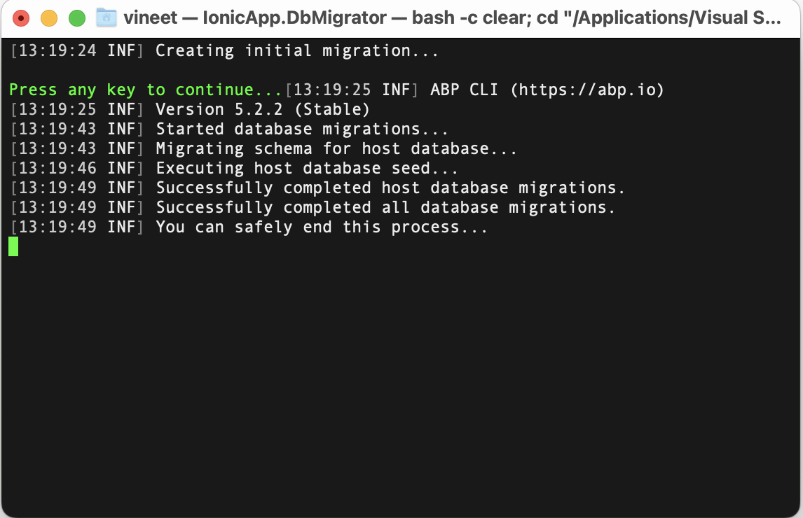

### IonicApp.HttpApi.Host

Open the `appsettings.json` in the IonicApp.HttpApi.Host project and add `http://localhost:8100` to `CorsOrigins` and `RedirectAllowedUrls` like below

```json
{
  "App": {
    "SelfUrl": "https://localhost:44367",
    "ClientUrl": "http://localhost:4200",
    "CorsOrigins": "https://*.IonicApp.com,http://localhost:4200,http://localhost:8100",
    "RedirectAllowedUrls": "http://localhost:4200,https://localhost:44307:http://localhost:8100"
  },
  "ConnectionStrings": {
    "Default": "Server=(LocalDb)\\MSSQLLocalDB;Database=IonicApp;Trusted_Connection=True"
  },
  "AuthServer": {
    "Authority": "https://localhost:44367",
    "RequireHttpsMetadata": "false",
    "SwaggerClientId": "IonicApp_Swagger",
    "SwaggerClientSecret": "1q2w3e*"
  },
  "StringEncryption": {
    "DefaultPassPhrase": "aBVYjSdEFT5E6GKf"
  }
}
```

Set the IonicApp.HttpApi.Host to be the startup project and run it you should see the below

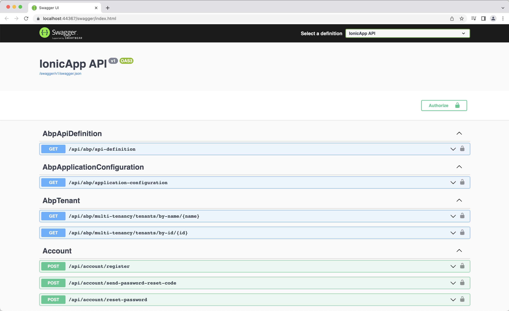

### ABP Angular UI

Open the `angular` folder inside your `IonicApp` folder in Visual Studio Code and open the tearmial and run the following command

```bash
Yarn
```

```bash
Yarn Sync
```

You should see the  below in your browsed

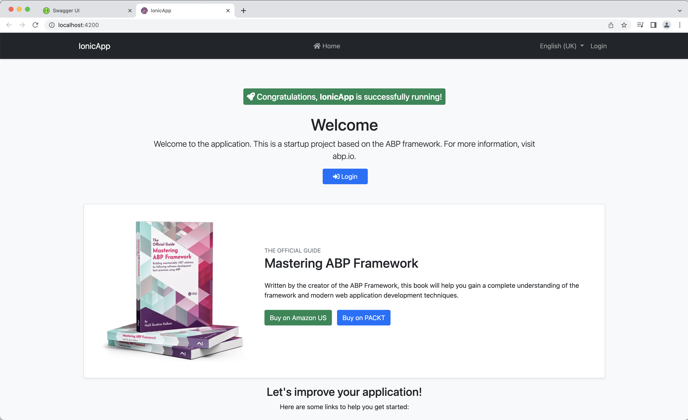

Login using the default username `admin` and password `1q2w3E*` and navigate to `Administration > Identity Management > Users` and create some uses like below

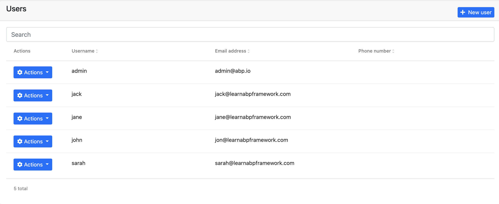

## Ionic Framework

Now for the fun part, in order to create a [Ionic](https://ionicframework.com) Mobile App we need to install Ionic CLI by running the following command

```bash
npm install -g @ionic/cli
```

Navigate to the IonicApp folder and now run the following command, the `start` creates a new Ionic Solution, the `type` of solution is Angular and `--capacitor` [Capacitor](https://capacitorjs.com) is a cross-platform native runtime that makes it easy to build modern web apps that run natively on IOS, Android, and the Web.

```bash
ionic start ionic-app blank --type=angular --capacitor
```

Using Visual Studio open the folder `Ionic-App` you should see the below

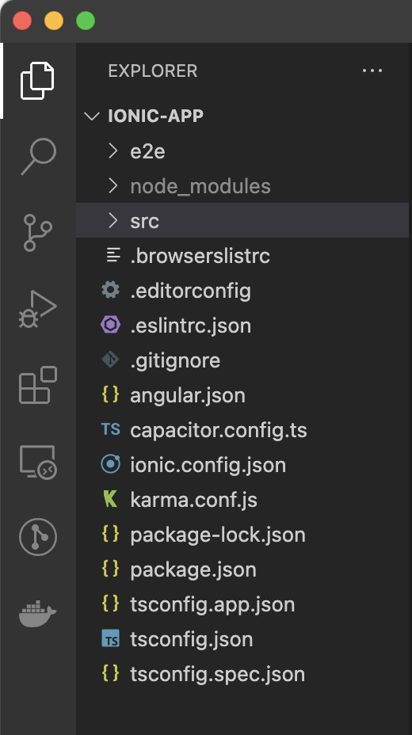

Run the Ionic Solution with the following command, and you should see the below in the browser

```bash
ionic serve
```

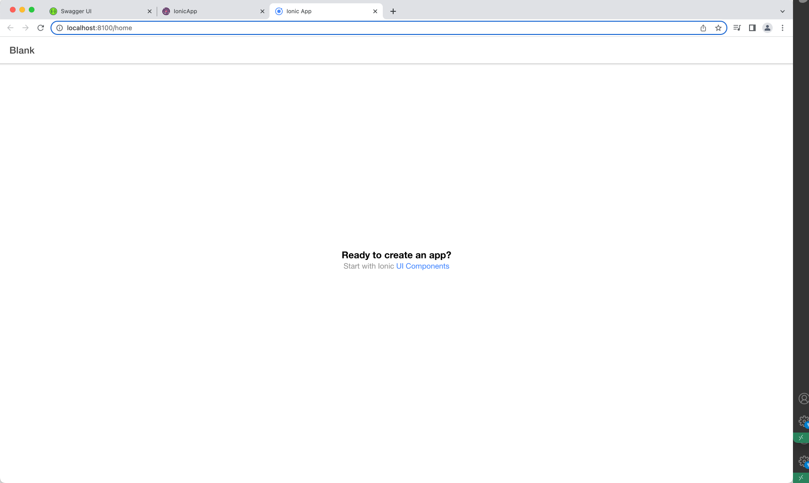

We will not install the ABP Packages so we can take advantage of the power of ABP, run the following commands in the Terminal in the `ionic-app` folder

```bash
npm install @abp/ng.core
```

> The `@abp/ng.core` package give you access to core functionality of ABP like ability to use the `RestService`, `Localization`, `Authorization` and `Permissions`  ect etc...

```bash
npm install @abp/ng.schematics --save-dev
```

> The @abp/ng.schematics is added as a development dependency to the project so we can generate the static proxy to access the ABP API

### environement.ts

Open `environment.ts` under the `src > environments` folder and change it with the following code

```typescript
import { Environment } from '@abp/ng.core';

const baseUrl = 'http://localhost:4200';

export const environment = {
  production: false,
  application: {
    baseUrl,
    name: 'IonicApp',
    logoUrl: '',
  },
  oAuthConfig: {
    issuer: 'https://localhost:44367',
    redirectUri: baseUrl,
    clientId: 'IonicApp_MobileApp',
    responseType: 'code',
    scope: 'offline_access IonicApp',
    requireHttps: true,
  },
  apis: {
    default: {
      url: 'https://localhost:44367',
      rootNamespace: 'IonicApp',
    },
  },
} as Environment;
```

> Note that we are defining a environment constant which has the `application`, `oAuthConfig` and `apis` information which i have copied from the angular project which was created as part of the ABP solution. I have just changed the `clientId` in the `oAuthConfig` object to `IonicAoo_MobileApp` and the base url to `http://localhost:8100`

### app.module.ts

Open `app.module.ts` under the `src > app` folder and change it with the following code

```typescript
import { NgModule } from '@angular/core';
import { BrowserModule } from '@angular/platform-browser';
import { RouteReuseStrategy } from '@angular/router';

import { IonicModule, IonicRouteStrategy } from '@ionic/angular';

import { AppComponent } from './app.component';
import { AppRoutingModule } from './app-routing.module';

import { registerLocale } from '@abp/ng.core/locale';
import { CoreModule } from '@abp/ng.core';
import { environment } from 'src/environments/environment';

@NgModule({
  declarations: [AppComponent],
  entryComponents: [],
  imports: [
    BrowserModule,
    IonicModule.forRoot(),
    AppRoutingModule,
    CoreModule.forRoot({
      environment,
      registerLocaleFn: registerLocale(),
    
    })
  ],
  providers: [{ provide: RouteReuseStrategy, useClass: IonicRouteStrategy }],
  bootstrap: [AppComponent],
})
export class AppModule {}
```

> Note that we have are importing `registerLocale` and `CoreModule` from the @abp/ng.core package and we are have added the `CoreModule.forRoot()` which has the `environment` and `registerLocale` as parameters.

### Generate Static Proxy

Now that we have imported the ABP packages we will now generate static proxies using the following command

```bash
abp generate-proxy -t ng -m identity -u https://localhost:44367
```

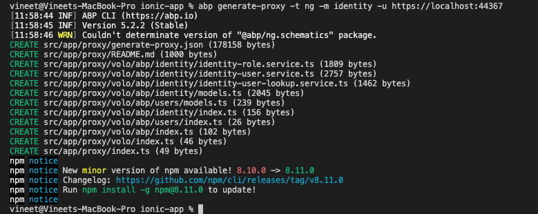

> Note the port need to nbe the port 44367 on which your `Ionic.HttpApi.Host` is running on, running the `generate-proxy` command will create a proxy folder under the `src > app` called `proxy`.

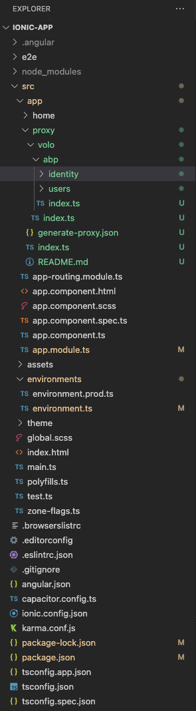

### home.page.ts

Navigate to `home.page.ts` under the `app > home` folder and change its code to the following

```typescript
import { Component } from '@angular/core';
import { AuthService, ConfigStateService, RestService } from '@abp/ng.core';
import { OAuthService } from 'angular-oauth2-oidc';
import { IdentityUserService } from '../proxy/volo/abp/identity';

@Component({
  selector: 'app-home',
  templateUrl: 'home.page.html',
  styleUrls: ['home.page.scss'],
})
export class HomePage  {
  title = 'custom-angular';

  users = [];

  tenantName = 'host';

  get hasLoggedIn(): boolean {
    return this.oAuthService.hasValidAccessToken();
  }

  // eslint-disable-next-line @typescript-eslint/member-ordering
  constructor(
    private oAuthService: OAuthService,
    private authService: AuthService,
    private identityService: IdentityUserService,
    private config: ConfigStateService
  ) {

    this.tenantName = this.config.getDeep('currentTenant.name');

    if (this.tenantName === null) {
      this.tenantName = 'host';
    }

  }

  login() {
    this.authService.navigateToLogin();
  }

  retrieveUsers() {
    this.identityService.getList({ maxResultCount: 10 }).subscribe((result) => {
      this.users = result.items;
    });
  }

  logout() {
    this.authService.logout();
  }

}
```

### home.page.html

Navigate to `home.page.html` under the `app > home` folder and change its code to the following

```html
<ion-header [translucent]="true">
  <ion-toolbar>
    <ion-title>
      ABP Ionic App - {{ tenantName }}
    </ion-title>
  </ion-toolbar>
</ion-header>

<ion-content [fullscreen]="true">
  <ion-button expand="full" (click)="login()" *ngIf="!hasLoggedIn">Login</ion-button>
  <ion-button expand="full" (click)="retrieveUsers()" *ngIf="hasLoggedIn">Get Users</ion-button>
  <ion-list>
    <ion-item *ngFor="let user of users">
      {{ user.name }}
    </ion-item>
  </ion-list>
  <ion-button expand="full" (click)="logout()" *ngIf="hasLoggedIn">Logout</ion-button>
</ion-content>
```

### Finally you have got your self a Mobile App

Run the Ionic Mobile App using the following command

```bash
ionic serve
```

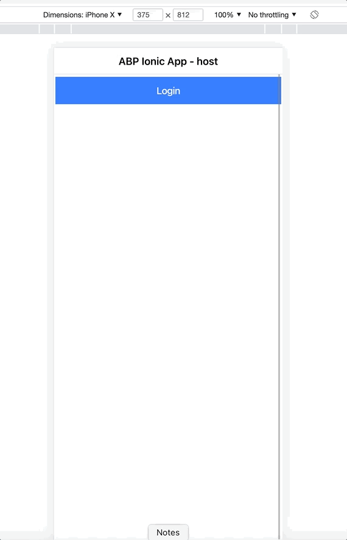
